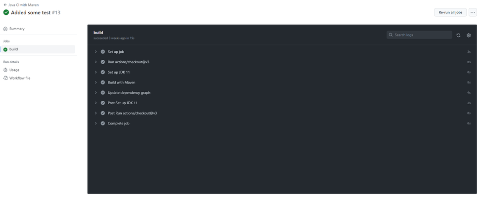
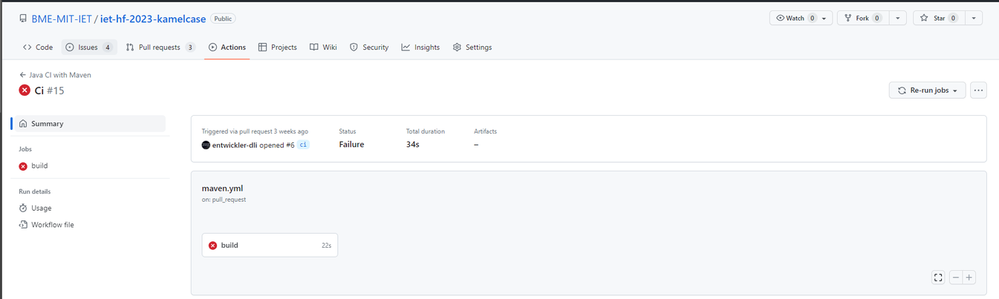
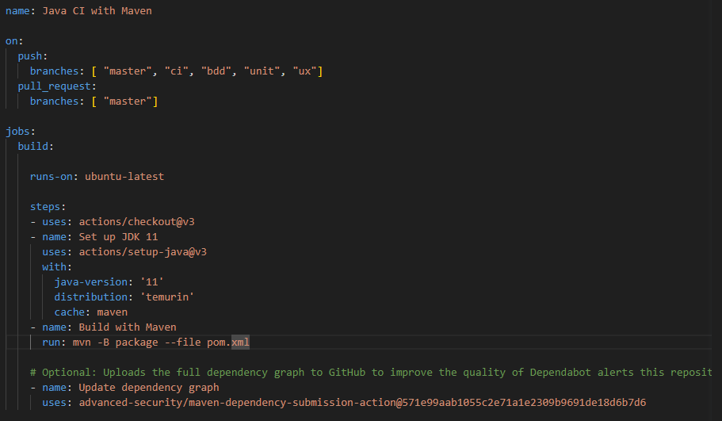

# Continuous Integration elkészítésének dokumentációja

# Feladat (céljának) rövid leírása

### A CI (Continuous Integration) integráció egy fejlesztési gyakorlat, melynek lényege, hogy a fejlesztők rendszeresen és folyamatosan/kis időközönként összefésülik a kódjukat egy közös repository-ban. A CI integráció célja az, hogy gyakran és automatizáltan ellenőrizze a kód változásait, és azonnal észlelje a hibákat vagy konfliktusokat.

### Számunkra ez a meglévő projekt keretein belül a következőket jelentették:
	- Kód begyűjtése: A csapat közös repository-jába létrehoztuk az egyes brancheket, melyekre beállítottuk a megfelelő Github Actions-t, amellyel az egyes branchekre időközönként történő pushokkal, automtikusan lefut az Actions, így nyomon követhetjük a kód változását és helyességét.
	- Automatikus tesztelés: A feladat során beállítottuk, hogy a forráskódban szereplő egység (Unit) tesztek minden egyes push után lefussanak, és erről visszajelzést adjon a csapat tagjainak. 
	- Visszajelzés: A Githubon a létrejött beállítás után, minden push hatására a tesztek lefutásáról a legfrisebb commit mellett egy az eredménytől függő ikon jelenik meg (amely lehet x, ha siekrtelen, és pipa, ha sikeres volt a lefutás)
	- Hibajavítás: A beállított Github Actions a hibákat nem javítja, ezeket a csapat fejlesztőinek kell manuálisan javítaniuk

# Megvalósítás főbb lépései

# 1. Elemzés:

 ## Feltérképeztük a jelenlegi beállításokat az alkalmazásban 
	- Eredetileg nem tartalmazott a projekt Maven build keretrendszert, illetve semmilyen CI nem lett létrehozva.
 ## Következtetés. 
 	- A csapattal közösen megbeszéltük, és megállapodtunk a Maven keretrendszer, és a Github Actions használatában.
 ## Meghatároztuk az elvégzendő céljainkat
	- Maven beállítása
	- Github Actions létrehozása
	- Megfelelő beállítások összeállítása
	- Beüzemelt CI megfelelő szintű tesztelése

# 2. Tervezés és megvalósítás
## Vázlat
	- A megvalósításhoz papíralapú tervezet nem készült
## Fejlesztői döntés
	- Döntésünk alapján a Maven 3.1-es verzióját használjuk
	- A CI beállításához elhatározásunk alapján a Github Actions-t választottuk 

# 3. Implementáció:
## Implementáció kivitelezése
	- A maven build keretrendszer hozzáadásához létrehoztuk az alkalmazásban a pom.xml file-t, ahol az alkalmazáshoz tartozó függőségeket lehet definiálni
	- A közös megállapodás szerint a JAVA JDK verzióját 11-esre állítottuk kompatibilitási okok miatt
	- A maven verziója a maven.compiler.source tag alatt található, ahogy fentebb említettük, itt a 3.1-es verzióra esett a választás
	- A Github Actions fülön legenárultuk és módosítottuk a yaml filet-t
		- beállítottuk a java verzióját
		- hozzáadtuk a megfelelő brancheket, illetve github commandokat
		- a yaml filehoz hozzáadásra került a következő futtatási maven parancs: mvn -B package --file pom.xml, így a buildelés a Maven keretrendszer segítségével történik

# 4. Értékelés és követés:
## Elkészült beállítások tesztelése
	- A véglegesen elkészült beállításokat megfelelőnek találtuk
	- A Github Actions CI branchen történő teszteléséhez egység tesztek is hozzáadásra kerültek, amelyeket a késsőbbiekben töröltünk
		- egy triviálisan helyes
		- egy triviálisan helytelen
	- Többszöri futtatás után is pozitív eredményeket értünk el
## Elért eredmények összegzése
	- Összességét tekintve a CI bevezetésével a csapat fejlesztői számára egy olyan lehetőséget biztosítottunk, hogy az egyes push commandok után az adott fejlesztő megbizonyosodhat a kivitelezett kódjának helyességéről
	- Ezzel átláthatóbbá tettük az esetleges hibák nyomonkövetését
	
# Releváns képek

## Pozitív teszt eredmény

#
## Negatív teszt eredmény

#
## Létrehozott és szerkesztett yaml file

