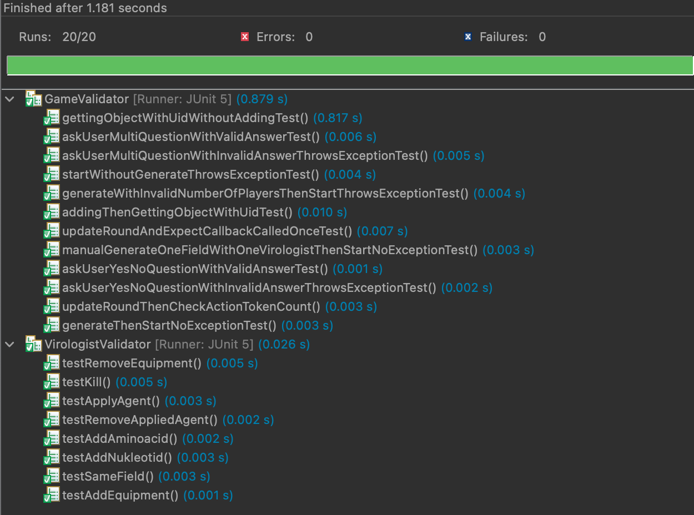

# Egységtesztek készítésének dokumentációja

## Feladat (céljának) rövid leírása

A feladat során egységteszteket írtunk az üzleti logika szempontjából két legfontosabb osztályra: Game, Virologist. A feladat megvalósítása során nem törekedtünk 100%-os kódlefedettségre, 
viszont minden fontosabb metódust leteszteltünk.

## Megvalósítás főbb lépései

1) JUnit keretrendszer hozzáadása a projekthez Maven-t használva.
	* Fontos volt hogy a tesztek a `src/test/java` alkönyvtárban legyenek, hogy Maven-el is futtathatóak legyenek.
2) Felosztottuk a két tesztelendő osztály tesztjeinek megírását:
	* Game: Pfemeter Márton
	* Virologist: Födémesi Lili
3) Megvalósítottuk a teszteket, illetve a tesztelés során a Mockito keretrendszert is hozzáadtuk a projekthez Maven-t használva.

## Releváns képek

### A sikeresen lefutott egységtesztek eredménye.

