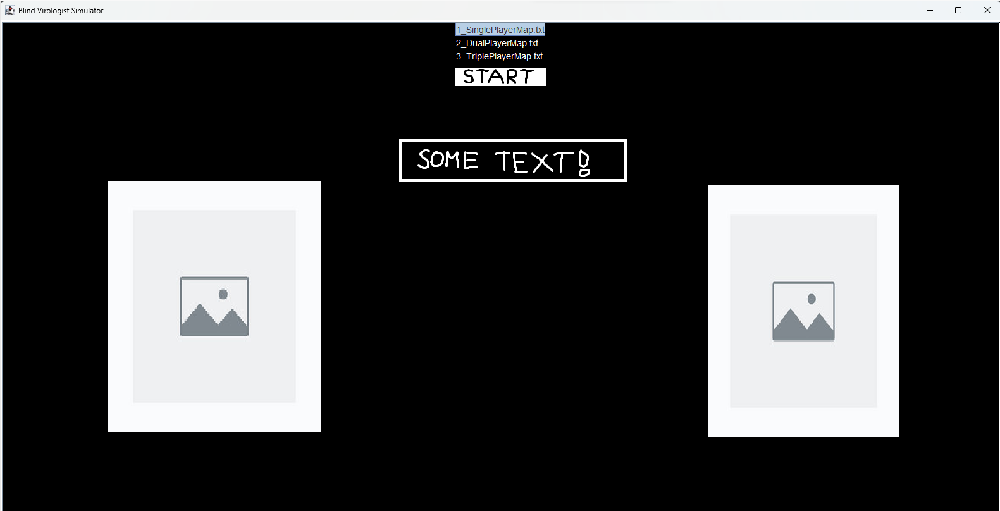
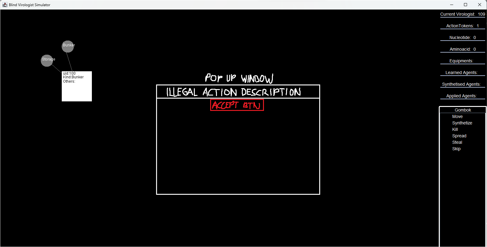
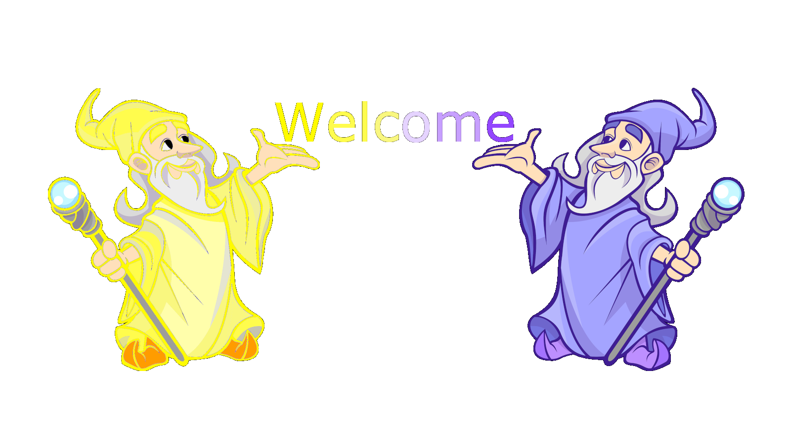

# Használhatóság (felhasználói élmény) javításának dokumentációja

# Feladat (céljának) rövid leírása

### Az UX (felhasználói élmény) fejlesztésének célja a felhasználók elégedettségének növelése és az alkalmazás használhatóságának javítása, valamint hatékonyabbá és vonzóbbá tétele.
### Számunkra ez a meglévő projekt keretein belül a következőket jelentették:
	- Használhatóság javítása: Az egyik fő célunk az alkalmazás könnyű használhatóságának biztosítása volt. Az interakciók, navigáció és funkciók egyszerűbbé és intuitívabbá tétele. Ezzel segítve a felhasználókat, hogy könnyedén megtalálják és elérjék a kívánt eredményeket.
	- Konverziók növelése: Szebb kezdőoldal, és egyértelműbb játékindítás 
	- Felhasználói elégedettség növelése: A vonzóbb aloldalak fejlesztése segít pozitív felhasználói élményt nyújtani. Az állandó felhasználónak adott visszajelzések elősegítik a könnyű navigációt az egyes lépések, és interakciók között.

# Megvalósítás főbb lépései

# 1. Elemzés és kutatás:

 ## Elemeztük és értékeltük a jelenlegi UX-t az alkalmazásban 
	- Eredetileg semmilyen főbb felhasználó élményt nyújtó támogatást nem tartalmazott
 ## Elvégeztünk egy rövid kutatást a felhasználói igényekről és elvárásokról. 
 	- A csapattal közösen megbeszéltük, hogy számukra mi lenne előnyös az alkalmazásban
 ## Meghatároztuk az elvégzendő céljainkat
	- Felhasználói visszajelzések adása, felugró ablakos visszajelzések, minden nem kivitelezhető lépés esetén
	- A bejelentkező oldal kiegészítése képpel/képekkel
	- Átláthatóbb navigáció az egyes mezők között

# 2. Tervezés és megvalósítás
## Vázlat
	- Vázlat terveinket a releváns képek blokkban lehet megtalálni
## Fejlesztői döntés
	- Döntésünk alapján a felhasználónak adott állandó visszajelzést implementáljük
	- Képet helyezünk el a felhasználói kezdő oldalon ezzel igényesebbé, és magával ragadóbbá téve az alkalmazás használatát.

# 3. Felhasználói tesztelés:
## Tesztelés
	- Az elkészült implementációt mind a csapattagokkal, mind a csapatban szereplő tagok rokonaival teszteltük, pozitív visszajelzések közepette.
## További módosítási igények
	- Minimális módosításokat ajánlottak a megjelenést illetően, így ezeket módosítottuk

# 4. Finomítás és implementáció:
## Módosítások kivitelezése
	- A finomítások során a megjelenés és egyedileg előállított saját kép került elhelyezésre, ezzel még sajátosabbá, és egyedibbé téve az alkalmazást

# 5. Értékelés és követés:
## Elkészült szoftver tesztelése
	- A véglegesen elkészült felhasználói felületet megfelelőnek találták az általunk célzott piac felhasználói
## Elért eredmények összegzése
	- Összességét tekintve sokkal átláthatóbbnak, és használhatóbbnak találták az alkalmazást. A játékmenet lefolyása is sokkal egyértelműbbé vált számukra. Így szignifikáns eredményeket értünk el a felhasználói élmények javításában.
	
# Releváns képek
## Start Page wireframe tervezet

#
## Game Page Pop Up Window: felhasználónak adott visszajelzés tervezet

#
## Általunk egyedileg létrehozott és szerkesztett képek

